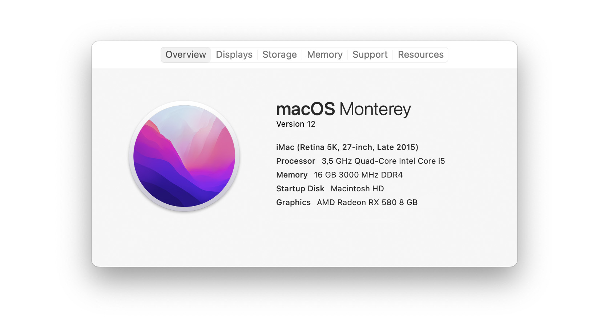
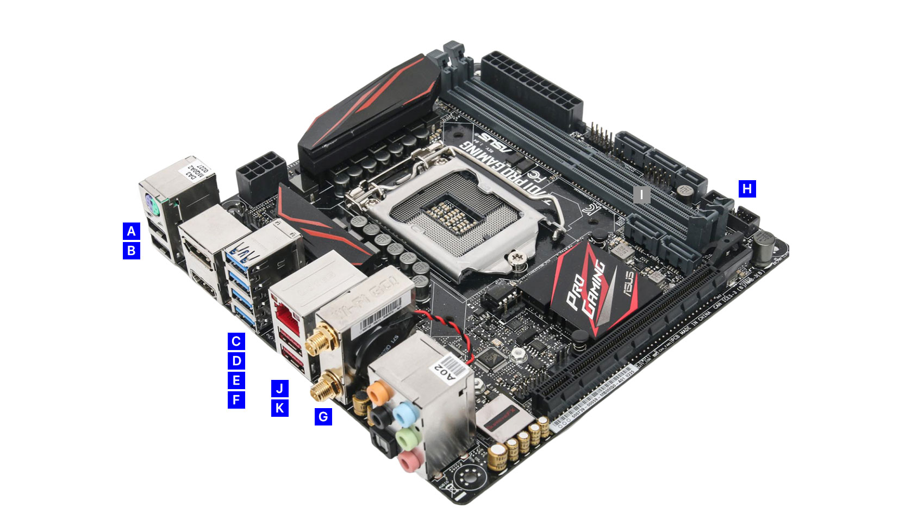
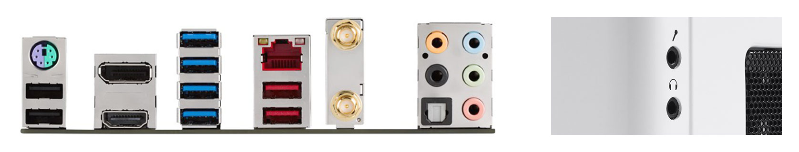

# OpenCore Asus Z170i Pro Gaming
An OpenCore EFI for Asus Z170i Pro Gaming mini-ITX motherboard, with Skylake processor. See compatible macOS versions in my releases. I'm using this build as a server. It is my third hackintosh build so far.

Though this is a ready to use EFI, it is for my own system, so **use at your own risk**. I truly recommend everyone to read [Dortania's OpenCore install guide](https://dortania.github.io/OpenCore-Install-Guide/). It's comprehensive, but take your time and have patience, there are no shortcuts to a perfect build.

I'm releasing it here to reference my own configuration, and to share my EFI with others, for a little help on the way. I will not publish releases every time I update OpenCore and drivers, but I will try to publish if I have enough spare time. **Do not forget** to [generate SMBIOS info](https://dortania.github.io/OpenCore-Install-Guide/config.plist/skylake.html#platforminfo) if you are planning on using this EFI in your build, since my releases does not include this information, for obvious reasons.

## Overview
- This build runs on the integrated GPU alone, it has no dedicated GPU. If you are using a dGPU you need to read the [GPU support](https://dortania.github.io/OpenCore-Install-Guide/macos-limits.html#gpu-support) wiki.
- No beauty treatments were done in this build, that means no OpenCore GUI and no boot-chime. I want to keep everything simple and minimal. You can enable all of this by following the [beauty treatment](https://dortania.github.io/OpenCore-Post-Install/cosmetic/gui.html) guide.
- Wireless card for bluetooth and wifi (Qualcomm Atheros QCNFA364A) is replaced. I'm using the Broadcom BCM94352Z DW1560 card instead. If you wish to swap the wireless card, remember to read [wireless buyers guide](https://dortania.github.io/Wireless-Buyers-Guide/) first.

## Hardware
Remember to read the [anti-hackintosh buyers guide](https://dortania.github.io/Anti-Hackintosh-Buyers-Guide/) if you're planning on buying components for a new build.

| Item        | Brand          | Model                                                     | Driver                                                                                                    | Comment         |
| ----------- | -------------- | --------------------------------------------------------- | --------------------------------------------------------------------------------------------------------- | --------------- |
| Motherboard | Asus           | Z170i Pro Gaming                                          | [OpenCorePkg](https://github.com/acidanthera/OpenCorePkg)  [Lilu](https://github.com/acidanthera/Lilu) |                 |
| CPU         | Intel          | Core i5 6600K 3,5GHz                                      | [VirtualSMC](https://github.com/acidanthera/VirtualSMC)                                                   | _Skylake_       |
| RAM         | Corsair        | Vengeance LPX DDR4 3000MHz 8GB x2              | built-in                                                                                                  |                 |
| iGPU        | Intel          | HD Graphics 530                                           | [WhateverGreen](https://github.com/acidanthera/WhateverGreen)                                             | _Headless mode_ |
| dGPU        | -              | -                                                         |                                                                                                           |                 |
| SSD         | Intel          | 970 EVO 500GB M.2 x1                           | [NVMeFix](https://github.com/acidanthera/NVMeFix)                                                         |                 |
| HDD         | WD             | Red 3TB 3.5" x1  Red 4TB 3.5" x3 | built-in                                                                                                  |                 |
| Bluetooth   | Broadcom       | BCM94352Z DW1560                                          | [AirportBrcmFixup](https://github.com/acidanthera/AirportBrcmFixup)                                       | _Replaced_      |
| Wifi        | Broadcom       | BCM94352Z DW1560                                          | [BrcmPatchRAM](https://github.com/acidanthera/BrcmPatchRAM)                                               | _Replaced_      |
| Ethernet    | Intel          | I219-V                                                    | [IntelMausi](https://github.com/acidanthera/IntelMausi)                                                   |                 |
| Audio       | Realtek        | ALC1150                                                   | [AppleALC](https://github.com/acidanthera/AppleALC)                                                       | _Layout-ID 99_  |
| PSU         | EVGA           | SuperNOVA G2 650W                                         |                                                                                                           |                 |
| Case        | Fractal Design | Node 304                                                  |                                                                                                           |                 |
| CPU cooler  | Cryorig        | H7                                                        |                                                                                                           |                 |
| Display     | EVanlak        | HDMI dummy                                                |                                                                                                           |                 |

## BIOS setup
Begin by loading optimized default options, then make sure settings are as below.

**Version 3805**

| Menu                                                 | Name                                     | Option            | Comment                          |
| ---------------------------------------------------- | ---------------------------------------- | ----------------- | -------------------------------- |
| **Exit**                                             | Load Optimized Defaults                  | Ok                | _Begin with default settings_    |
| **Ai Tweaker**                                       | Ai Overclock Tuner                       | XMP               | _Personal preference_            |
| **Advanced**  `CPU Configuration`                 | Intel Virtualization Technology          | Enabled           | _**Recommended \***_             |
| `CPU Configuration`                                  | SW Guard Extensions (SGX)                | Disabled          | _**Recommended \***_             |
| `CPU Configuration >`  `CPU - Power Management`   | CFG Lock                                 | Disabled          | _**Recommended \***_             |
| `System Agent Config`                                | VT-d                                     | Disabled          | _**Recommended \***_             |
| `System Agent Config`                                | Above 4G Decoding                        | Enabled           | _**Recommended \***_             |
| `System Agent Config >`  `Graphics Configuration` | Primary Display                          | CPU Graphics      | _This build has no dGPU_         |
| `System Agent Config >`  `Graphics Configuration` | iGPU-Multi-Monitor                       | Disabled          | _This build has no dGPU_         |
| `System Agent Config >`  `Graphics Configuration` | DVMT Pre-Allocated                       | 64M               | _**Recommended \***_             |
| `PCH Configuration`                                  | IOAPIC 24-119 Entries                    | Enabled           |                                  |
| `PCH Storage Config`                                 | SATA Mode Selection                      | AHCI              | _**Recommended \***_             |
| `Onboard Devices Config`                             | SupremeFX LED Lighting                   | Disabled          | _Personal preference_            |
| `Onboard Devices Config`                             | Asmedia USB 3.1 Controller               | Enabled           |                                  |
| `Onboard Devices Config`                             | Asmedia USB 3.1 Battery Charging Support | Enabled           | _Personal preference_            |
| `APM Configuration`                                  | Restore AC Power Loss                    | Power On          | _Personal preference_            |
| `APM Configuration`                                  | Power On By PCI-E                        | Enabled           |                                  |
| `Network Stack Config`                               | Network Stack                            | Disabled          |                                  |
| `USB Configuration`                                  | Legacy USB Support                       | Enabled           |                                  |
| **Boot**                                             | Fast Boot                                | Disabled          | _**Recommended \***_             |
| `Boot Configuration`                                 | POST Delay Time                          | 0 sec             | _Personal preference_            |
| `Boot Configuration`                                 | Wait For 'F1' If Error                   | Disabled          | _Personal preference_            |
| `Boot Configuration`                                 | Setup Mode                               | Advanced Mode     | _Personal preference_            |
| `CSM (Compatibility Support Module)`                 | Launch CSM                               | Disabled          | _**Recommended \***_             |
| `Secure Boot`                                        | Secure Boot state                        | Disabled          | _**Recommended \***_             |
| `Secure Boot`                                        | OS Type                                  | Windows UEFI mode | _**Recommended \***_             |
|                                                      | Boot Option #1                           | UEFI OS           | _Disable all other boot options_ |
| **Exit**                                             | Save Changes & Reset                     | Ok                | _Save BIOS and reset_            |

_* As recommended in OpenCore install guide, [Skylake: Intel BIOS settings](https://dortania.github.io/OpenCore-Install-Guide/config.plist/skylake.html#intel-bios-settings)._

## USB ports
For USB mapping I enabled **ten** physical ports, and bluetooth. That is every port available, except the internal USB 2.0 Header. Remember that you can have a total of 15 ports per USB controller, this board has two controllers. USB 3.0/1 counts as two ports for backward compatibility. See image and table below which ports are available and which I chose to map in USBPorts.kext. Use [USBMap](https://github.com/corpnewt/USBMap) or [Hackintool](https://github.com/headkaze/Hackintool) if you wish to create your own USB map. The ASMedia USB controller did not need a USB map.

| Port | Type                      | Name                                    | Enabled                                                                                                                                                                                                                                     | Comment                 |
| :--: | ------------------------- | --------------------------------------- | ------------------------------------------------------------------------------------------------------------------------------------------------------------------------------------------------------------------------------------------- | ----------------------- |
|  A   | USB 2.0 Type-A | HS09                                    |                                                                                                                                                                                        |                         |
|  B   | USB 2.0 Type-A | HS10                                    |                                                                                                                                                                                        |                         |
|  C   | USB 3.0 Type-A | HS05 + SS05                             |  +                                                                                                                                |                         |
|  D   | USB 3.0 Type-A | HS06 + SS06                             |  +                                                                                                                                |                         |
|  E   | USB 3.0 Type-A | HS07 + SS07                             |  +                                                                                                                                |                         |
|  F   | USB 3.0 Type-A | HS08 + SS08                             |  +                                                                                                                                |                         |
|  G   | Bluetooth                 | HS13                                    |                                                                                                                                                                                        |                         |
|  H   | USB 3.0 Header            | HS01 + SS01 &nbsp; / &nbsp; HS02 + SS02 |  +  &nbsp; / &nbsp;  +  | _Front panel_           |
|  I   | USB 2.0 Header            | HSxx + HSxx                             |  +                                                                                                                                  | _PCI bracket *_         |
|  J   | USB 3.1 Type-A | 1 + 3                                   |  +                                                                                                                                | _ASMedia controller **_ |
|  K   | USB 3.1 Type-A | 2 + 4                                   |  +                                                                                                                                | _ASMedia controller **_ |

_* I have no PCI bracket for the USB 2.0 Header, so I could not recognize the names for those ports._ 
_** This is the second USB controller and has its own port limit. No need for USB map on this controller._

## Audio layout
For audio layout i used **layout-ID 99**, it seemed most appropriate. Layout-ID 7 works as well, with the same exact functionality*. All other compatible layouts for this audio chipset were tested and did not work fully.

 Blue audio jack acts as `Line In` 
 Green audio jack acts as `Internal Speakers` 
 Red audio jack acts as `Internal Microphone`

 Orange audio jack acts as `Line Out` 
 Black audio jack acts as `Line Out` 
 Optical S/PDIF acts as `Digital Out`

 Front panel top audio jack acts as `Line In` _(switches from Internal Microphone if plugged in)_ 
 Front panel bottom audio jack acts as `Headphones` _(switches from Internal Speakers if plugged in)_

_* The only difference between these layouts is that layout99.xml has the key MaximumBootBeepValue, value 64. It also has the key DspFunction2 with various other keys and values._

## What works?
Everything except sleep works. Wifi and bluetooth (by replacing the internal Qualcomm Atheros QCNFA364A), iGPU acceleration, HDMI audio, wake up from display sleep. Ethernet, all USB ports (only the internal USB 2.0 Header is disabled), all Audio ports. AirDrop, Handoff, iMessage, FaceTime and other iServices.

## Known issues
- [ ] Sleep does not work.

_Without a dGPU, sleep does not work. This build will never sleep though. Perhaps a deep dive in the [fixing sleep](https://dortania.github.io/OpenCore-Post-Install/universal/sleep.html) guide will solve issue?_

## Extras

### Debugging OpenCore

  
Quick guide on how to debug OpenCore with my releases.

   

My releases are prepared for easy dubugging, all you have to do is download the DEBUG version of [OpenCorePkg](https://github.com/acidanthera/OpenCorePkg). Reminder, it's a good idea booting the debug EFI from a USB stick.

**Swap the following files:**

EFI > BOOT > `BOOTx64.efi` 
EFI > OC > `OpenCore.efi` 
EFI > OC > Drivers > `OpenRuntime.efi`

**Change to the following values in** `config.plist`**:**

Misc > Debug > AppleDebug > `True` 
Misc > Debug > ApplePanic > `True` 
Misc > Debug > DisableWatchDog > `True` 
Misc > Debug > Target > `67` 
NVRAM > Add > 7C436110-AB2A-4BBB-A880-FE41995C9F82 > boot-args > `-v keepsyms=1`

Restart computer and make sure you boot from the same volume you made the changes in. Verbose mode is now active and log files will be saved to the same volume. When you're done and everything works, swap back files from the RELEASE version and revert the values in config.plist.

_**Reference: https://dortania.github.io/OpenCore-Install-Guide/troubleshooting/debug.html**_
 

### Quick Reference Guide
Visit my [Quick Reference Guide](https://github.com/jimpalompa/macOS-OpenCore-Quick-Reference-Guide) for more macOS and OpenCore commands, guides, fixes and features.

## Software
A collection of apps that may come handy when configuring your build. Reminder, if you wish to use this EFI in your own build, you need to [generate SMBIOS info](https://dortania.github.io/OpenCore-Install-Guide/config.plist/skylake.html#platforminfo) first. System will not boot without it. Use EFI at your own risk.

[GenSMBIOS](https://github.com/corpnewt/GenSMBIOS) for generating SMBIOS 
[MountEFI](https://github.com/corpnewt/MountEFI) for mounting EFI partitions 
[ProperTree](https://github.com/corpnewt/ProperTree) for editing config.plist 
[OCConfigCompare](https://github.com/corpnewt/OCConfigCompare) for comparing config.plist with new releases 
[USBMap](https://github.com/corpnewt/USBMap) for USB port mapping 
[Hackintool](https://github.com/headkaze/Hackintool) for USB port mapping and more 
[IORegistryClone](https://github.com/khronokernel/IORegistryClone) for browsing IO registry

## Acknowledgements
Apple for macOS 
[Acidanthera](https://github.com/acidanthera) for OpenCore 
[dortania](https://github.com/dortania) for guide 
[CorpNewt](https://github.com/corpnewt) for software 
[headkaze](https://github.com/headkaze) for Hackintool 
[xzhih](https://github.com/xzhih) for HiDPI 
And everyone from the OpenCore community 🖤
